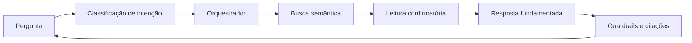

# Arquitetura

O projeto usa uma arquitetura modular simples, sem framework de agentes.

## Fluxo principal

1. `app/main.py` cria configuração, índice, tools e agente.
2. `repository/reader.py` descobre e lê arquivos sob limites de caminho e tamanho.
3. `retrieval/` concentra chunking, embeddings, armazenamento vetorial e recuperação.
4. `agent/orchestrator.py` coordena LLM, tools, evidências e resposta.
5. `app/ui.py` oferece o Gradio e `app/session.py` gerencia a sessão temporária.
6. `evaluation/` mede comportamento, groundedness, citações e uso de tools.

## Pacotes

- `app/`: entrada, configuração, sessão e interface.
- `agent/`: orquestração, prompts, guardrails, evidências e intenções.
- `retrieval/`: pipeline completo de RAG.
- `repository/`: leitura segura e análise estrutural.
- `tools/`: registro e implementações de tools.
- `workflows/`: fluxos determinísticos e formatação.
- `evaluation/`: casos e validações de fidelidade.

## Regras de dependência

- A UI pode depender do agente e da indexação; o agente não depende da UI.
- Workflows não conhecem Gradio, Ollama ou detalhes de sessão.
- Evaluation pode observar a API pública do agente; o runtime não importa os casos de eval.
- Memória e estado não conhecem LLM, tools ou domínio do repositório.
- A API pública continua sendo `from repo_agent_chat.agent import ToolAgent`.

## Ciclo de uma pergunta

Busca semântica localiza candidatos; `read_file` confirma o código-fonte. Essa separação
reduz alucinações e não exige que um modelo pequeno planeje perfeitamente todas as tools.
